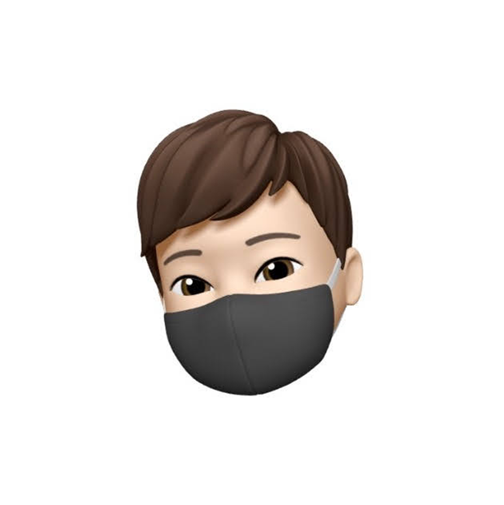
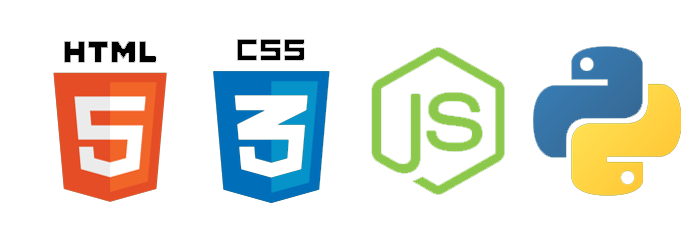

    
    

<h1>About Me 關於我:</h1>

🎈 Contact 聯繫方式 [Discord Server](https://discord.gg/rGQzfv2Zud) `LAI#6043`

<h2>Projects 專案</h2>

<table>
	<thead>
		<tr>
		<th>Name 關於我</th>
		<th>Description 描述</th>
		<th>Language 語言</th>
		<th>File 檔案</th>
		</tr>
	</thead>
	<tbody>
		<tr>
			<td><a href="https://github.com/fosscord/fosscord">Easymc help page</a></td>
			<td>A EastMC tutorials, and problem resolve</td>
			<td>html css js</td>
			<td></td>
		</tr>
	</tbody>
</table>
